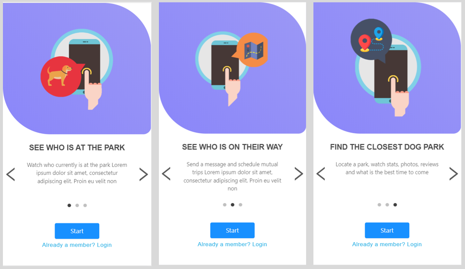
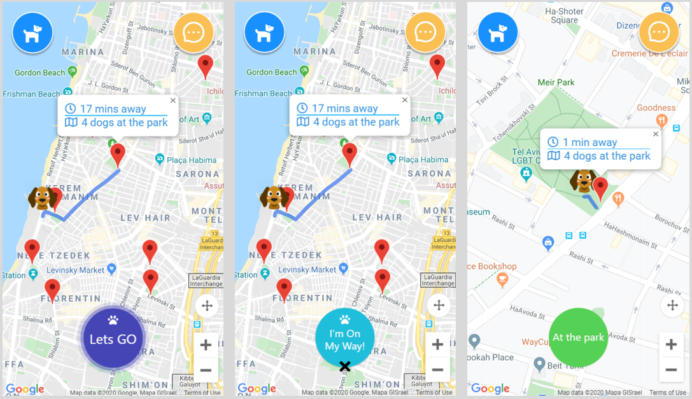
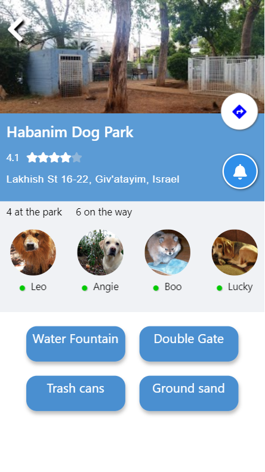
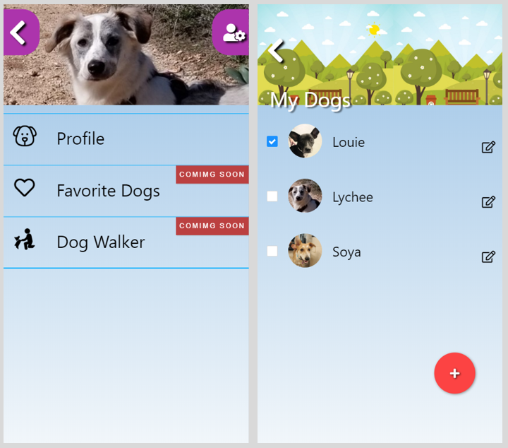
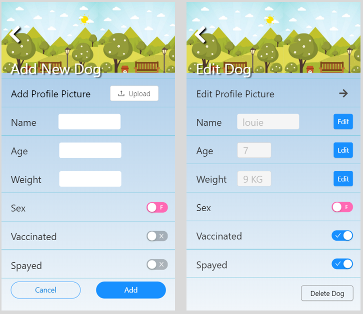

# Kelev-App

Kelev-App is a social network app that connects dog owners , dogs and dog-parks. 

# Table Of Contents

- [Kelev-App](#kelev-app)
  - [Screenshots](#screenshots)
    - [First Screen](#first-screen)
    - [Main Map](#main-map)
    - [Dog-Park](#dog-park)
    - [Profile](#profile)
  - [Techstack](#tech-stack)
  - [TODO](#todo)

## Screenshots

### First Screen

When the user opens the app for the fist time, he gets information regarding the app and its features.

### Main Map

The main maps displays the closest dog-parks based on the users location. After a user selects a park the app offers a navigation path and displays estimated arrival time by walking.
The app watches the users position and detects when he arrived to the park in order to inform others.

### Dog-Park

As a user clicks on a pop-up of a certain dog-park , the app provides him with the inforamtion of who is currently at the park, who's on its way, park ameneties as well as park pics & rating. 

### Profile 

The user page contains menu where he can access his dogs page , and see the upcomig features. When he clicks on a profile he can see a list of his dogs and have the ability to choose with which of the dogs he is going to the park.

A user can add new dog to his list or edit the dog's details if needed.

## Techstack

- React with MobX
- MySQL
- Google API's (maps, places, directions, matrix)
- NodeJS, Express
- Ant design

## TODO

1. make the app user authenticated.
2. Add favorite dogs featue.
3. Add a Dog Walker feature. 

